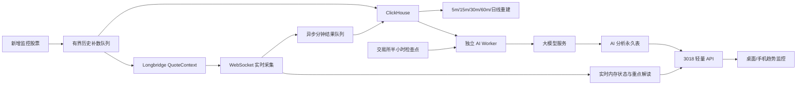

# 趋势监控历史补数、手机布局与半小时 AI 分析设计

日期：2026-07-31
状态：用户已批准设计内容，等待书面规格复核
适用系统：TickFlow Stock Panel 趋势监控、Longbridge 行情采集服务、ClickHouse

## 1. 背景与目标

趋势监控当前存在三类相互独立的问题：

1. `RNG.US` 日线评估向 `19912 /api/dow-state/evaluate` 发送了不可接受的日线数据，产生 HTTP 400；
2. 新加入监控的股票缺少历史结构数据，需要等待较长时间才能形成完整的 5m、15m、30m、60m 和日线判断；
3. 桌面完整指标表在手机上信息密度过高，且系统缺少基于当日累计指标、每半小时生成一次的独立大模型综合分析。

本轮目标是：

- 修复日线评估非法数值导致的 400；
- 新增股票后异步、幂等地补齐评估所需历史结构，不阻塞 WebSocket 实时行情；
- 增加前端版本更新发现与安全刷新机制；
- 为趋势监控增加手机端紧凑布局；
- 对处于正常盘中交易时段的监控股票，每完成一个半小时窗口生成一份独立 AI 综合分析并永久保存；
- 保证 AI 分析与现有实时重点解读、正式买卖信号完全隔离。

## 2. 稳定需求

### REQ-DOW-MONITOR-DAILY-PAYLOAD-SAFETY-001

日线评估调用前必须校验并清洗 OHLCV：

- 拒绝或过滤 `NaN`、正负无穷、缺失时间、非正价格和不满足 OHLC 关系的数据行；
- 不得把非有限浮点数编码进发往 `19912` 的 JSON；
- 清洗后数据不足评估器最低要求时，不调用评估接口，返回结构化的“历史结构不足”状态；
- 日线失败不得影响其他周期评估、WebSocket 行情或列表展示；
- `RNG.US` 必须有可复现的失败样本及修复后的语义验收证据。

### REQ-DOW-MONITOR-NEW-SYMBOL-HISTORY-BACKFILL-001

新增监控股票的接口必须立即返回，随后通过有界后台队列自动检查和补齐结构历史：

- 先检查 ClickHouse 已有分钟线、日线及各周期可构建数据，只请求缺失范围；
- 补数必须复用现有 Longbridge 行情采集进程的 `QuoteContext`，盘中不得另建额外行情连接；
- 不覆盖 WebSocket 已保存的实时记录；
- 重复加入、服务重启或任务重试必须幂等；
- 目标数据量由各周期评估器的最低输入要求决定，至少覆盖最近完整交易日和当日开盘以来的数据；
- 补数完成后重新构建 5m、15m、30m、60m 和日线状态；
- 页面能够看到排队、补数中、重建中、完成、部分完成和失败状态，以及仍缺失的周期；
- 补数失败时 WebSocket 实时观察继续运行，不得阻塞或重连实时行情。

### REQ-DOW-MONITOR-FRONTEND-VERSION-REFRESH-001

前端必须能发现服务端已发布新版本，避免旧单页应用长期运行：

- 构建产物和服务端暴露相同的不可变构建版本标识；
- 页面每 60 秒轻量检查一次版本；
- 前台页面发现版本不一致时显示明确更新提示，由用户点击刷新；
- 后台页面在没有提交请求、添加股票或打开需保留状态的弹窗时可以自动刷新；
- 版本检查失败不得中断行情、指标或用户操作；
- 同一版本只提示一次，不形成刷新循环。

### REQ-DOW-MONITOR-MOBILE-COMPACT-LIST-001

小于 `768px` 的趋势监控列表采用已批准的方案 B：

- 第一层展示股票名称/代码、现价/涨跌幅和 Mini 日趋势线；
- 第二层全宽展示现有“重点解读”；
- 第三层展示独立“半小时 AI 分析”入口及最近窗口状态；
- 其他原始指标列在手机列表中隐藏，但通过现有详情展开能力仍可访问；
- 暂停、删除等管理操作进入紧凑操作入口，不得丢失能力；
- 桌面端继续展示完整指标表，不改变每页 20 只、详情开合或现有列语义；
- 手机端不得产生页面级横向滚动。

### REQ-DOW-MONITOR-HALF-HOUR-AI-ANALYSIS-001

系统必须为“趋势监控中已启用且所在市场处于正常连续交易时段”的股票生成独立半小时 AI 分析：

- 只在一个完整的 30 分钟交易窗口结束后调度；
- 使用交易所日历和交易所本地时间，跳过盘前、午间休市、盘后和休市日；
- 分析输入为该股票当日开盘至窗口截止时间的累计指标与结构数据；
- 新加入股票从加入后的下一个完整半小时检查点开始生成，输入仍应尽可能补齐至当日开盘；
- 每只股票、每个交易日、每个窗口至多有一份成功结果；
- 调度重启时只补跑该股票加入后、当前交易日遗漏的窗口，不重复调用已成功窗口；
- AI 调用在独立工作进程中执行，默认并发为 1，不占用 `3018` 请求线程和 WebSocket 实时处理链路；
- AI 分析不得生成、修改、清除、升级或替代正式买卖信号；
- AI 分析不得改变现有实时“重点解读”的规则、内容和刷新方式；
- 所有成功和失败版本永久保存，不设置 TTL。

### REQ-DOW-MONITOR-HALF-HOUR-AI-VIEW-001

半小时 AI 分析必须通过独立入口按需查看：

- 列表只返回最新窗口、状态、是否可查看和分析 ID 等轻量字段；
- 长内容点击后在独立分析弹窗中加载，不直接展开在表格单元格；
- 默认显示最新成功结果，并可按交易日和半小时窗口查看历史版本；
- 状态至少包含：等待首轮、排队中、分析中、成功、失败、数据不足；
- 当前窗口失败时保留上一份成功结果，并明确标示当前窗口失败；
- 分析内容必须展示数据截止时间和所使用的数据完整性；
- 弹窗必须明确说明这是周期性辅助分析，不是正式买卖信号。

## 3. 已批准的总体架构

采用“实时链路、历史补数、AI 分析三条独立任务路径”的方案。



核心隔离要求：

- WebSocket 收到数据后立即更新实时内存状态，不等待 ClickHouse 写入；
- ClickHouse 分钟保存继续异步和错峰，不在行情回调内执行阻塞写；
- 历史补数复用采集服务已有行情连接，通过有界队列控制请求速率；
- AI Worker 只读已完成窗口的累计数据，独立调用模型并写入独立表；
- `3018` 只提供状态与历史查询接口，不承担模型推理；
- 任一补数、模型或持久化错误都不得使实时行情连接重启。

## 4. RNG.US 日线 400 修复

### 4.1 失败边界

日线评估请求构造器必须在网络请求之前完成规范化：

1. 统一时间并按时间升序；
2. 将 OHLCV 转为有限数值；
3. 丢弃存在非有限价格、非正价格或非法 OHLC 关系的行；
4. 成交量非有限或为负的行不得进入请求；
5. 去除重复时间，只保留确定规则选出的最终记录；
6. 校验清洗后的有效行数。

如果有效行数不足，结果为：

```json
{
  "status": "insufficient_history",
  "timeframe": "day",
  "reason": "valid_daily_bars_below_minimum",
  "valid_bars": 8,
  "required_bars": 20
}
```

不得用零值填补缺失价格，也不得继续发送可能包含非法 JSON 数值的请求。

### 4.2 验收

必须先建立会产生 `NaN` 或无穷值的失败测试，证明旧实现会构造非法请求；修复后验证：

- 发送体只包含标准 JSON 有限数值；
- 不足数据不会请求 `19912`；
- 其他周期正常返回；
- 生产样本 `RNG.US` 不再出现日线 400。

## 5. 新股票自动补历史

### 5.1 任务生命周期

`POST /api/dow-monitor/symbols` 完成股票注册后立即返回，不等待历史数据。

后台任务顺序：

1. 读取该股票市场、交易所日历和各评估器最低历史要求；
2. 检查 ClickHouse 已有范围、断档和当前日数据；
3. 形成精确缺口计划；
4. 将请求提交给 Longbridge 采集服务的有界历史请求队列；
5. 通过现有 `QuoteContext` 获取官方历史或 recent candlesticks；
6. 以幂等键写入缺失数据，不覆盖 WebSocket 实时记录；
7. 重建多周期结构；
8. 发布补数状态和最新结构可用性。

### 5.2 连接与资源边界

- 盘中禁止为补数创建第二个 Longbridge `QuoteContext`；
- 补数请求与实时订阅共享连接，但以低优先级、有界队列和速率限制执行；
- 实时行情处理始终优先；
- 单股失败不阻塞队列中的其他股票；
- 队列满时保留明确的排队/重试状态，不静默丢弃。

### 5.3 幂等与数据优先级

历史数据键必须至少包含市场、股票、周期和 K 线开始时间。

当同一分钟同时存在 WebSocket 实时记录和历史补数记录时：

- 已完成且质量合格的 WebSocket 记录不被覆盖；
- 历史记录只补空缺或替换明确标记为不完整的记录；
- 重复任务不会产生重复有效行；
- 重启后根据持久化任务状态或数据缺口恢复，不依赖进程内记忆。

## 6. 半小时 AI 分析

### 6.1 调度语义

调度器使用交易所日历，不使用固定北京时间判断全球市场是否开盘。

每个完整 30 分钟交易窗口结束后，等待分钟数据水位到达窗口截止时间，再创建任务。等待超过规定宽限期仍不完整时，可生成“数据不足”记录，但不得把缺失值当作零。

示例：

- A 股上午从 09:30 开始，首个窗口在 10:00 结束；11:30 后跳过午休，下午从 13:00 重新累计有效交易分钟；
- 港股按港交所正常连续交易阶段处理；
- 美股按交易所本地时间及夏令时处理，不把盘前盘后纳入；
- 特殊休市、半日市以交易所日历为准。

股票在 10:45 加入时，首个计划窗口为 11:00；如果历史补数成功，11:00 分析可使用当日开盘至 11:00 的累计输入。加入之前已经结束的窗口不补生成 AI 文本。

### 6.2 输入快照

AI Worker 一次性读取窗口截止时已经持久化的累计数据，输入至少包括：

- 现价、当日涨跌幅、开高低、日内位置；
- VWAP、VWAP 偏离及方向；
- 1m、5m、15m 动量及一致性；
- 5m、15m、30m、60m 和日线结构状态；
- 同时段相对量能、量能加速度、放量方向；
- 主动买入、订单流不平衡、盘口深度和价差；
- ATR%、当日振幅/ATR；
- 突破参考区间、确认价、失效价和当前重点解读；
- 每类数据的最新时间、完整性和缺失原因；
- 上一个半小时 AI 结果的结构化摘要，用于说明变化，但不得作为新的市场事实。

输入快照与结果一起保存，以便复核模型当时看到的事实。不得包含密钥、用户个人信息、账户资金、联系方式或支付信息。

### 6.3 输出结构

模型输出必须通过结构化模式校验后保存：

```json
{
  "overall_state": "偏强|偏弱|震荡|机会形成中|风险增加|数据不足",
  "summary": "一行摘要",
  "changes": ["相较上一窗口的主要变化"],
  "evidence": [
    {
      "label": "VWAP偏离",
      "value": "+1.25%",
      "meaning": "价格仍位于当日成交成本上方"
    }
  ],
  "opportunity_conditions": ["需要继续满足的条件"],
  "risk_conditions": ["判断失效或风险扩大的条件"],
  "data_quality": ["缺失、延迟或预热说明"]
}
```

规则：

- 数字必须来自输入快照，不允许模型编造价格、区间或指标；
- 没有足够证据时必须输出“数据不足”或“震荡”，不得强行制造机会；
- 不得输出自动下单、保证收益或确定性预测；
- 不得把内容写入正式买卖信号字段；
- 结构校验失败视为当前窗口失败，可重试但不能保存为成功分析。

### 6.4 调度、重试与隔离

- AI Worker 为独立进程或容器，默认并发 `1`；
- 每个任务有明确超时，最多进行有限次数重试；
- 幂等键为 `market + symbol + trade_date + window_end`；
- 成功结果不可因普通重试而重复调用和覆盖；
- 失败记录保留错误分类、次数和最后更新时间；
- 服务重启只补跑当前交易日、股票加入以后遗漏且未成功的窗口；
- 队列积压、模型限流或不可用只影响 AI 状态，不影响实时页面和正式信号。

## 7. ClickHouse 持久化

新增永久表，建议命名：

```text
longbridge.lb_dow_monitor_half_hour_ai_analyses
```

建议使用 `ReplacingMergeTree(updated_at)`，排序键：

```text
(market, symbol, trade_date, window_end)
```

核心字段：

| 字段 | 含义 |
| --- | --- |
| `market` / `symbol` | 市场和标准股票代码 |
| `trade_date` | 交易所本地交易日 |
| `window_end` | 交易所本地半小时窗口截止时间 |
| `window_end_utc` | 用于跨市场统一排序的 UTC 时间 |
| `status` | pending/running/completed/failed/insufficient_data |
| `model_provider` / `model_name` | 实际模型来源和模型名 |
| `input_snapshot_json` | 当时使用的累计指标快照 |
| `summary` | 列表和历史索引使用的短摘要 |
| `analysis_json` | 结构化完整结果 |
| `analysis_text` | 面向用户的完整可读文本 |
| `source_start` / `source_end` | 输入数据覆盖范围 |
| `data_quality` | 完整性与延迟信息 |
| `error_code` / `error_message` | 失败信息 |
| `created_at` / `updated_at` | 审计时间 |

该表不设置 TTL。更新采用版本列和幂等键，查询最新值时不得依赖后台 merge 已经发生。

## 8. API 契约

### 8.1 列表轻量状态

趋势监控概览为每只股票新增独立字段：

```json
{
  "half_hour_ai_analysis": {
    "latest_window_end": "2026-07-31T10:30:00-04:00",
    "status": "completed",
    "available": true,
    "analysis_id": "opaque-id",
    "updated_at": "2026-07-31T22:31:40+08:00"
  },
  "history_backfill": {
    "status": "completed",
    "progress": 100,
    "missing_timeframes": [],
    "last_error": null
  }
}
```

完整 AI 文本不得进入 WebSocket 高频概览消息。

### 8.2 历史与详情

提供按需读取接口：

```text
GET /api/dow-monitor/{symbol}/ai-analyses?trade_date=YYYY-MM-DD
GET /api/dow-monitor/{symbol}/ai-analyses/{analysis_id}
```

要求：

- `analysis_id` 为不透明标识，客户端不得自行拼接；
- 市场或代码歧义时必须显式传递标准身份；
- 历史列表按窗口倒序；
- 不存在、无权限和数据不足使用明确状态码与错误结构；
- 查询失败不清空页面上已经加载的上一份结果。

### 8.3 前端版本

提供不缓存或短缓存的轻量版本接口，返回：

```json
{
  "build_id": "20260731-<commit>",
  "published_at": "2026-07-31T23:00:00+08:00"
}
```

HTML、静态资源和版本接口的缓存策略必须协同，保证新构建可被发现且静态资源仍可使用内容哈希长期缓存。

## 9. 页面设计

### 9.1 桌面端

- 保留现有完整指标表；
- 新增一个紧凑的“AI 半小时分析”入口或状态，不直接渲染长文本；
- “重点解读”继续由当前确定性实时解释器生成；
- 每页 20 只、分页、排序、详情开合和异常高亮保持不变。

### 9.2 手机端方案 B

手机列表卡行结构：

```text
股票名称/代码        现价/涨跌幅        Mini 日趋势

重点解读：当前机会、风险或数据状态

AI综合分析 · 10:30 · 可查看                  ⋯
```

状态文案示例：

```text
AI综合分析 · --:-- · 等待首轮
AI综合分析 · 11:00 · 分析中
AI综合分析 · 11:00 · 可查看
AI综合分析 · 11:00 · 本轮失败，上次可查看
```

重点解读不因手机布局被截成仅标题；允许合理折行，但列表默认高度应保持可扫读。原始指标通过详情展开查看。

### 9.3 独立分析弹窗

点击入口后打开页面内独立弹窗，避免浏览器弹窗拦截。弹窗包含：

1. 股票、市场、交易日和数据截止时间；
2. 半小时版本选择器，默认最新成功版本；
3. 综合判断与摘要；
4. 本周期变化；
5. 具体指标证据；
6. 机会条件与风险/失效条件；
7. 数据完整性；
8. “辅助分析，不是正式买卖信号”说明。

弹窗按需请求数据，关闭后不影响实时列表订阅。

## 10. 前端版本更新行为

页面启动时记录当前 `build_id`，之后每 60 秒检查：

- 当前标签页可见：显示固定但不遮挡行情的更新提示，用户点击后刷新；
- 当前标签页隐藏：在没有进行中写操作和需保护弹窗状态时自动刷新；
- 正在添加/删除股票、修改状态或查看尚未保存的交互时延后；
- 标签页重新可见时再次判断；
- 同一新版本不重复弹出多个提示；
- 刷新后构建 ID 一致，提示消失。

服务端版本接口不可用时仅记录诊断信息，不影响应用。

## 11. 错误与降级

| 故障 | 页面行为 | 对实时链路影响 |
| --- | --- | --- |
| 日线存在非法数值 | 日线显示历史结构不足或清洗后结果 | 无 |
| 历史补数失败 | 展示缺失周期和可重试状态，继续实时预热 | 无 |
| ClickHouse 分钟写入延迟 | AI 等待水位或标记数据不足 | 无 |
| AI 超时/限流 | 当前窗口失败，保留上次成功结果 | 无 |
| AI 输出格式非法 | 有限重试后保存失败状态 | 无 |
| AI 历史接口失败 | 弹窗保留已加载内容并显示错误 | 无 |
| 版本接口失败 | 忽略本轮检查 | 无 |
| 新版本发布 | 前台提示或后台安全刷新 | WebSocket 重连仅发生在正常页面刷新 |

## 12. 规格兼容与权威边界

本设计与已有规格的关系：

- 现有“重点解读列不调用大模型、不新增持久化”的要求继续适用于该确定性实时组件；本设计新增的是独立半小时 AI 模块，不修改该组件；
- 现有“保留全部指标列”的要求继续适用于桌面表格；本设计只在 `<768px` 手机断点隐藏原始列表列，所有指标仍可在详情访问；
- 现有正式买卖信号和分钟决策规格保持权威；AI 分析没有信号写权限；
- 现有 WebSocket 实时快速路径保持权威；补数、分钟保存和 AI 不得进入行情回调同步路径；
- 现有分钟历史补数规格继续约束 Longbridge 数据来源、幂等写入和盘中连接数量。

实施前必须把本设计的稳定需求登记到相应仓库 `docs/spec-index.yaml` 和 `docs/traceability.yaml`。跨仓库职责分别为：

- `longbridge-stock`：共享 `QuoteContext` 的历史请求队列、官方历史补数和底层数据验收；
- `tickflow-monitor-list-v2`：日线请求清洗、多周期重建状态、AI Worker、ClickHouse AI 表、API 和响应式前端。

任何跨仓库契约不一致都必须先形成明确权威决定，不能靠调用方测试替代数据提供层验收。

## 13. 测试与语义验收

必须遵循测试先行，先观察行为测试失败，再修改生产代码。

### 13.1 底层数据层

- 非有限 OHLCV 清洗和不足历史分支；
- `RNG.US` 失败载荷复现；
- 缺口计算、官方历史请求、WebSocket 记录优先级；
- 重复任务和重启恢复幂等；
- 盘中不创建额外 `QuoteContext`；
- ClickHouse 实际行数、时间范围、价格关系和交易日归属验收。

只有底层数据语义通过后，才能验收多周期状态或 AI 内容。

### 13.2 调度与 AI

- A 股、港股、美股交易所日历、午休、夏令时、休市和半日市；
- 加入股票后的首个窗口；
- 每窗口成功结果唯一；
- 重启补跑遗漏窗口但不重复成功调用；
- 累计输入严格截止于 `window_end`，不使用未来数据；
- 模型超时、限流、格式错误和持久化失败隔离；
- 输出数字均可追溯到保存的输入快照；
- AI 不能写正式信号字段。

### 13.3 API 与前端

- 概览只包含轻量 AI 状态；
- 弹窗按需加载、历史版本倒序和失败保留旧内容；
- 手机端方案 B 的信息顺序、无横向滚动及详情可访问性；
- 桌面完整表格回归；
- 构建版本不一致提示、后台安全刷新和操作中延后；
- 实时价格持续更新时，AI 长文本和重点解读互不覆盖。

### 13.4 生产验收

在 `10.28` 发布后至少验证：

1. `RNG.US` 日线不再返回 400；
2. 新增一只测试股票，接口立即返回且补数状态可观测；
3. 补数期间 WebSocket 行情持续更新；
4. 多周期结构在补数后自动转为可用；
5. 至少覆盖一个实际市场半小时窗口，AI 结果成功入表并能在独立弹窗查看；
6. 当前窗口失败模拟不会影响实时列表和正式信号；
7. 手机真实视口只显示方案 B 核心信息，详情仍可访问全部指标；
8. 发布新构建后旧页面能够发现版本变化；
9. 静态 bundle、`3018` API、`19912` 评估服务和 ClickHouse 表分别通过检查。

截图和快照只能作为视觉辅助，不能替代数据层、调度层和信号隔离的语义证据。

## 14. 文档与独立复核

实施任务必须：

- 更新两个适用仓库的规格索引和追踪矩阵；
- 为每个稳定需求登记实现文件、可执行测试、底层验收和生产证据；
- 更新 `E:\Obsidian-alwin\alwin\longbridge-stock\dow-monitor-system-api-runbook.md`，记录新增进程、表、API、版本检查、补数链路、端口与发布验证步骤；
- 完成独立的需求到证据复核，确认没有用前端结果或 AI 文本替代底层数据验收；
- 在所有生产发布动作前完成回归测试和部署前检查。

## 15. 非目标

- 不实现自动交易或自动下单；
- 不让大模型决定、修改或替代正式买卖信号；
- 不把半小时 AI 文本混入实时重点解读；
- 不扩大趋势监控股票范围，仍只处理用户启用的股票；
- 不分析盘前、盘后或休市阶段；
- 不回补股票加入之前已经结束的 AI 分析窗口；
- 不在手机端删除任何指标能力，只改变列表默认可见性；
- 不因历史补数新增独立盘中行情连接；
- 不在本轮重构无关页面或策略。
